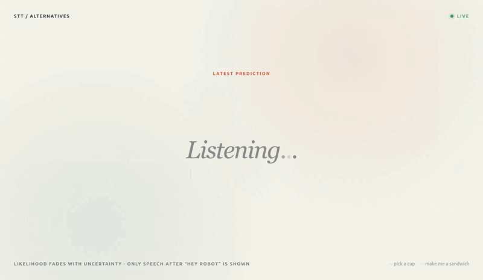

# Natural language processing

Package requires [hri_msgs](https://github.com/imitrob/franka_hri/tree/main/hri_msgs).

This package include a personalized way of how I use 1. speech-to-text, 2. text-to-speech, and 3. legacy NL processing.

1. Speech to text `ros2 run natural_langauge_processing stt_node` where it's automatic mode detects passphrase "hey robot" and the following command:
2. Text-to-speech `ros2 run natural_langauge_processing tts_node` uses Kokoro 82M model.
3. Natural language processing setup from 2023 that is no longer used, but kept as a reference, for NL setup, see [franka_hri](https://github.com/imitrob/franka_hri/tree/main).


Speech-to-text visualizer: `ros2 run natural_language_processing stt_visualizer`



## Install

Install packages:
```
conda env create -f environment.yml
cd <your_ws>/src/natural_language_processing
```

## Usage

```
ros2 run natural_language_processing nl_node
```

Always-listening wake interaction keeps audio in memory and publishes the
command after hearing one utterance beginning with "hey robot":

```
ros2 run natural_language_processing stt_node
ros2 run multi_modal_reasoning multi_modal_reasoning --name_user demo
```

Both default to `--interaction auto`; pass `--interaction manual` for the
Enter-controlled recording. Either way the services and the topic carry
`words_json` next to the plain text: one entry per word with its real start and
end, and whisper's own candidates for it.

```
[{"start": 1700000003.06, "end": 1700000003.42, "word": "spongewipe",
  "alts": {"spongewipe": 0.721, "spongebob": 0.138, "sponge": 0.132}}]
```

Times are absolute, on the clock the recording started on, so they compare
directly with gesture stamps. Probabilities are whisper's own and are **not**
renormalised -- the mass missing from `alts` is the model's uncertainty about
words outside the list. `Transcribe`/`TranscribeAudio` take a `stamp` request
field to place the words on that clock; 0 leaves them relative to the audio.

The merger always queues the full distribution. How much of it a method reads
is that method's declared `ADAPTER_LEVEL`: A0 takes the winning word via
`to_a0()`, A2 reads the candidates.

`--audio-device` accepts a PortAudio index or a name substring, and falls back
to `AUDIO_DEVICE`, then to `Jabra`, then to the system default input. Wake
phrase, VAD threshold, pre-roll, silence timeout, and duration limits are at the
top of `speech_to_text/wake_word_listener.py`.

### Speech alternatives visualizer

Run the standalone browser view alongside auto-mode `stt_node`:

```
ros2 run natural_language_processing stt_visualizer
```

Then open <http://localhost:8765>. The winning sentence stays on the center
line. For each word, Whisper's alternatives alternate above and below it and
fade with their raw likelihood. The page reconnects automatically and needs no
rosbridge or third-party JavaScript.

The server binds to localhost by default. Use `--host 0.0.0.0` to view it from
another machine, `--port` to choose another port, or `--topic` to subscribe to
a different `hri_msgs/WhisperText` topic.

## FAQ:

- If recording not working: Try to copy the alsa lib to the miniconda
`mkdir ~/miniconda3/envs/<conda env>/lib/alsa-lib/`
`sudo cp /usr/lib/x86_64-linux-gnu/alsa-lib/* ~/miniconda3/envs/<conda env>/lib/alsa-lib/`
